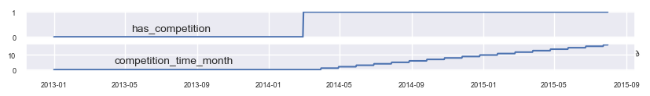
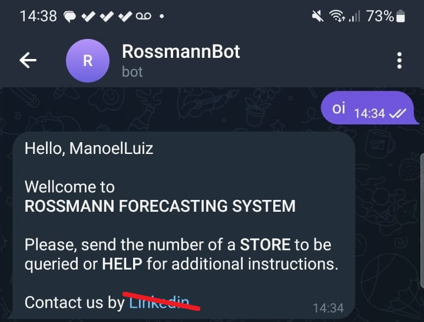

<h1 align="center">
ROSSMANN DRUGSTORE CHAIN<br>REVENUE FORECASTING
</h1>

<h6>- <a href="README.md">VERSÃO EM PORTUGUÊS</a></h6>


<details>
<summary>Rossmann Landscape</summary>


</details>


# 1. INTRODUCTION

This report describes a Data Science project aimed at developing a **Regression Algorithm** using machine learning to forecast the revenue of each store in a pharmaceutical retail chain. The project follows the CRISP-DM methodology, ensuring a structured and efficient approach.  

In this project, we utilized the following tools and techniques:  

- **Tools**: VS-Code, Jupyter Notebook, Mini Conda, GitHub, GPT-4  
- **Programming & Libraries**: Python, Pandas, Numpy, Scikit-Learn, Matplotlib, Seaborn  
- **Machine Learning Models**: Linear Regression (Simple & Lasso), Random Forest, XGBoost  
- **Feature Selection & Validation**: Boruta, Cross-Validation  
- **Deployment & API**: Flask API, Telegram Bot API, hosting on [Render.com](https://render.com/)  

The data was sourced from a Kaggle competition, comprising over one million sales records from more than a thousand stores. Five machine learning algorithms were tested, and the XGBoost Regressor was selected as the final model due to its superior performance in metrics such as MAE, MAPE, and RMSE.  

The final deliverables are listed in [Section 3.1](#31-final-product): (i) business insights, (ii) a *machine learning* model, and (iii) a Telegram Bot. Details on the algorithm results are presented from [Section 7](#7-result-ii-forecasting-model) onward.  

Each section of this report was developed independently, resulting in a relatively more extensive final document.  


# 2. THE COMPANY & THE BUSINESS PROBLEM

According to [Wikipedia](https://en.wikipedia.org/wiki/Rossmann_(company))<sup>1</sup>, the company Rossmann, or more specifically, Dirk Rossmann GmbH, is a chain of pharmaceutical stores founded in 1972 and headquartered in Burgwedel, Germany. In its history of [major achievements](https://unternehmen.rossmann.de/ueber-uns/unsere-geschichte.html)<sup>2</sup>, the company highlights the following accomplishments in 2023 alone:  

1. Ranked 16th on the [Forbes](https://www.forbes.com/lists/worlds-best-employers/?sh=4a53ed2f1e0c) list of the world’s best companies to work for in 2023<sup>3</sup>, as well as 3rd place among companies in Germany.  
2. Its products became available in more than 1,500 stores of the SPAR, EUROSPAR, and INTERSPAR chains, covering Austria, Hungary, Slovenia, Croatia, and northern Italy.  
3. Initiated a partnership with the Chinese supermarket chain FRESHIPPO, part of the Alibaba Group, making its products available in more than 300 FRESHIPPO branches in China.  

Currently, store managers are tasked with forecasting their daily sales for the next six weeks. Store sales are influenced by numerous factors, including promotions, competition, school holidays and public holidays, seasonality, and local conditions. With thousands of individual managers predicting sales based on their specific circumstances, the accuracy of the results can vary significantly.  

To improve these forecasts, Rossmann's Data Science Team has been assigned the task of developing a model capable of predicting six weeks of daily sales for a set of 1,115 stores located in Germany. The motivation for this project lies in the fact that obtaining reliable sales forecasts allows store managers to create effective workforce plans, increasing both productivity and motivation. By building a robust forecasting model, store managers will be able to stay focused on what matters most: their customers and their teams.  

*Disclaimer*: This project is a fictional case based on the *Rossmann Store Sales* challenge published on [Kaggle](https://www.kaggle.com/competitions/rossmann-store-sales) in 2015<sup>4</sup>.  


# 3. SOLUTION PLANNING  

## 3.1. Final Product  

As described in the business problem, the challenge for the Data Science Team is to develop a model capable of predicting six weeks of daily sales for a subset of Rossmann stores.  

Thus, the proposed solution consists of delivering three key outcomes:  

1. **Business insights** derived from the analysis of the provided data.  
2. **Machine learning model** capable of meeting the company's demand for forecasting the accumulated revenue of its stores for the next six weeks.  
3. **Telegram bot** to enable mobile phone access for consulting the store revenue forecasts.  


## 3.2. Solution Strategy  

The project was carried out following the CRISP-DM method (*Cross Industry Standard Process for Data Mining*), a cyclical approach that enhances quality and accelerates the delivery of results in Data Science projects. This method can be summarized in the following set of steps:  

1. Business understanding  
2. Data collection, processing, and modeling  
3. Machine learning algorithms  
4. Evaluation of results  
5. Deployment into production  

  


# 4. AVAILABLE DATA  

This section aims to understand the peculiarities of the existing data. The data available for forecasting studies are those provided by the client company in three files: **STORE.CSV, TRAIN.CSV, and TEST.CSV**.  

<table align="center">
<tr><td>

</td></tr>
</table>

By opening these files in a spreadsheet (e.g., Excel), it is possible to identify several characteristics, which are described below.  


## 4.1. The STORE.CSV File  

The **STORE.CSV** file contains a store registry with **1,115 records**, providing information about the characteristics of each store to be analyzed. Its **10 columns** include the following attributes:  


<table align="center">
  <tr>
    <th align="center">ATTRIBUTE</th>
    <th>DESCRIPTION AND NOTES</th>
  </tr>
  <tr>
    <td align="center">Store</td>
    <td>Unique identifier for each store. The table contains 1,115 stores numbered from 1 to 1,115, ensuring no duplicates.</td>
  </tr>
  <tr>
    <td align="center">StoreType</td>
    <td>Indicates store types. The dataset includes four types: <b>A</b> (602 stores), <b>B</b> (17), <b>C</b> (148), and <b>D</b> (348).</td>
  </tr>
  <tr>
    <td align="center">Assortment</td>
    <td>Indicates the level of product variety in stock: <b>A</b> = basic (593 stores), <b>B</b> = extra (9), <b>C</b> = extended (513).</td>
  </tr>
  <tr>
    <td align="center">CompetitionDistance</td>
    <td>Distance in meters to the nearest competitor.</td>
  </tr>
  <tr>
    <td align="center">CompetitionOpenSince [Month/Year]</td>
    <td>Two columns indicating the approximate month and year when the nearest competitor opened.</td>
  </tr>
  <tr>
    <td align="center">Promo2</td>
    <td>A continuous and consecutive promotion available in some stores. The attribute has the following values: <b>1</b> = the store is participating in Promo2 (571 stores), <b>0</b> = the store is not participating in Promo2 (544 stores).</td>
  </tr>
  <tr>
    <td align="center">Promo2Since [Year/Week]</td>
    <td>Two columns indicating the year and week when the store started participating in Promo2.</td>
  </tr>
  <tr>
    <td align="center">PromoInterval</td>
    <td>Indicates the consecutive monthly intervals when the "Promo2" promotion is reactivated, specifying the months in which the promotion restarts. For example, "Feb, May, Aug, Nov" means that each round starts in February, May, August, and November of any year for that store.</td>
  </tr>
</table>


(Source: [Kaggle](https://www.kaggle.com/competitions/rossmann-store-sales), *Rossmann Store Sales*<sup>4</sup>)  

An initial inspection of the **STORE.CSV** file reveals that stores can be classified into one of **four store types** (*store_type* = A, B, C, or D) and into one of **three assortment types** (*assortment*: A = basic, B = extra, or C = extended). Based on this classification, the number of stores per **type + assortment** is as follows:  


<table align="center">
    <tr>
        <td colspan=2 rowspan=2 align="center"><b>Quantidade</b></td>
        <td colspan=4 align="center"><b>store_type</b></td>
        <td rowspan=2><b>TOTAL</b></td>
    </tr>
    <tr>
        <td align="center"><b>A</b></td>
        <td align="center"><b>B</b></td>
        <td align="center"><b>C</b></td>
        <td align="center"><b>D</b></td>
    </tr>
    <tr>
        <td rowspan=3><b>assortment</b></td>
        <td><b>A=basic</b></td>
        <td align="center">381</td>
        <td align="center">7</td>
        <td align="center">77</td>
        <td align="center">128</td>
        <td align="center"><b>593</b></td>
    </tr>
    <tr>
        <td><b>B=extra</b></td>
        <td align="center">-</td>
        <td align="center">9</td>
        <td align="center">-</td>
        <td align="center">-</td>
        <td align="center"><b>9</b></td>
    </tr>
    <tr>
        <td><b>C=extended</b></td>
        <td align="center">221</td>
        <td align="center">1</td>
        <td align="center">71</td>
        <td align="center">220</td>
        <td align="center"><b>513</b></td>
    </tr>
    <tr>
        <td colspan=2 align="center"><b>TOTAL</b></td>
        <td align="center"><b>602</b></td>
        <td align="center"><b>17</b></td>
        <td align="center"><b>148</b></td>
        <td align="center"><b>348</b></td>
        <td align="center"><b>1.115</b></td>
    </tr>
</table>


In this table, some aspects stand out. Regarding the store type, we observe that:  

- The vast majority of stores (85%) belong to types **A (602)** and **D (348)**.  
- The remaining **15%** of stores—types **B and C**—account for **1.5% (B)** and **13.3% (C)** of the entire network.  

When combining this information with the assortment type, we find that:  

- Among **type A** stores, the predominant assortment type is **"basic"**.  
- Among **type D** stores, the predominant assortment type is **"extended"**.  
- There are only **nine** stores with an **"extra"** assortment type, and all of them are **type B** stores. Therefore, there are no **type A, C, or D** stores with an **"extra"** assortment.  


## 4.2. The TRAIN.CSV File  

The **TRAIN.CSV** file contains **over one million rows**, with **time-series data**, i.e., the daily sales history of each store. The dataset includes the following **nine attributes**:  

<table align="center">
  <tr>
    <th align="center">ATTRIBUTE</th>
    <th>DESCRIPTION</th>
  </tr>
  <tr>
    <td align="center">Store</td>
    <td>Foreign key identifying each store (from 1 to 1,115).</td>
  </tr>
  <tr>
    <td align="center">DayOfWeek</td>
    <td>Day of the week, represented by numerical values from <b>1 (Monday)</b> to <b>7 (Sunday)</b>.</td>
  </tr>
  <tr>
    <td align="center">Date</td>
    <td>The date on which sales occurred. Values range from <b>01/01/2013 to 31/07/2015</b>.</td>
  </tr>
  <tr>
    <td align="center">Sales</td>
    <td>Sales volume of the day.</td>
  </tr>
  <tr>
    <td align="center">Customers</td>
    <td>Number of customers on that day.</td>
  </tr>
  <tr>
    <td align="center">Open</td>
    <td>Indicator of whether the store was <b>closed (0) or open (1)</b> on that date.</td>
  </tr>
  <tr>
    <td align="center">Promo</td>
    <td>Indicates whether the store was running a <b>one-time promotional campaign</b> on that day.</td>
  </tr>
  <tr>
    <td align="center">StateHoliday</td>
    <td>Indicates a <b>state holiday</b>. Stores are usually closed on state holidays. Possible values: <b>A = public holiday, B = Easter holiday, C = Christmas, 0 = not a holiday</b>.</td>
  </tr>
  <tr>
    <td align="center">SchoolHoliday</td>
    <td><b>School holiday</b> indicator. Shows whether the record (<b>Store + Date</b>) was affected by public school closures.</td>
  </tr>
</table>


(Source: [Kaggle](https://www.kaggle.com/competitions/rossmann-store-sales), *Rossmann Store Sales*<sup>4</sup>)  

In this dataset, out of a total of **1,017,209 daily records**, **844,392 (83%)** correspond to days when stores were open.  

It is also noteworthy that the dataset contains a **"promo"** field, which allows for recording **one-time promotional events** on specific days. This differs from **"Promo2"**, which represents a **structured, ongoing monthly promotion program**.  

Ultimately, the data used in this project result from merging the information from **STORE.CSV** and **TRAIN.CSV**.  


## 4.3. The TEST.CSV File  

The **TEST.CSV** file contains **over 40,000 records** corresponding to **856 stores**, with information related to daily activity from **August 1 to September 17, 2015**. The dataset does not include information on daily sales volume (**'sales'**) or the number of daily customers (**'customers'**).  

In this project, the **TEST.CSV** file is used during the **real-time forecasting phase** through the **TELEGRAM BOT application**, described in **Section 8**.  

The file contains the following attributes:  

<table align="center">
  <tr>
    <th align="center">ATTRIBUTE</th>
    <th>DESCRIPTION</th>
  </tr>
  <tr>
    <td align="center">Id</td>
    <td>Unique identifier representing <b>Store + Date</b>.</td>
  </tr>
  <tr>
    <td align="center">Store</td>
    <td>Unique identifier for each store.</td>
  </tr>
  <tr>
    <td align="center">DayOfWeek</td>
    <td>Day of the week, represented by numerical values from <b>1 (Monday)</b> to <b>7 (Sunday)</b>.</td>
  </tr>
  <tr>
    <td align="center">Date</td>
    <td>The date corresponding to the record. Values range from <b>01/08/2015 to 17/09/2015</b>.</td>
  </tr>
  <tr>
    <td align="center">Open</td>
    <td>Indicator of whether the store was <b>closed (0) or open (1)</b>.</td>
  </tr>
  <tr>
    <td align="center">Promo</td>
    <td>Indicates whether the store was running a <b>promotion</b> on that day.</td>
  </tr>
  <tr>
    <td align="center">StateHoliday</td>
    <td>Indicates a <b>state holiday</b>. Stores are usually closed on state holidays. All schools close on public holidays and weekends. Possible values: <b>A = public holiday, B = Easter holiday, C = Christmas, 0 = not a holiday</b>.</td>
  </tr>
  <tr>
    <td align="center">SchoolHoliday</td>
    <td><b>School holiday</b> indicator. Shows whether the record (<b>Store + Date</b>) was affected by public school closures.</td>
  </tr>
</table>


(Source: [Kaggle](https://www.kaggle.com/competitions/rossmann-store-sales), *Rossmann Store Sales*<sup>4</sup>)  


# 5. DATA PREPARATION  

The following describes the data preprocessing steps taken to prepare the dataset for applying machine learning algorithms.  

## 5.1. Handling NaN Values  

NaN stands for "*Not a Number*" and represents a missing or undefined value in a dataframe. In this project’s dataset, occurrences of NaN were handled in the following features:  

- **competition_distance**: NaN values were replaced with a significantly large distance (200,000).  
- **competition_open_since_month**: NaN values were replaced with the month from the **'date'** variable.  
- **competition_open_since_year**: NaN values were replaced with the year from the **'date'** variable.  
- **promo2_since_week**: NaN values were replaced with the week corresponding to the **'date'** variable.  
- **promo2_since_year**: NaN values were replaced with the year from the **'date'** variable.  
- **promo_interval**: NaN values were replaced with zero.  

For future enhancements, different strategies for handling NaN values may be explored. One possibility is using a **Random Forest algorithm** to fill in missing values based on patterns in the dataset. Another approach could involve using the **K-means clustering algorithm** to segment the data and then replace missing values with the mean values of each cluster.  


## 5.2. Feature Engineering  

From the original data (described in **Section 4** above), new features were derived to capture:  

- The ongoing promotional program (**promo2**),  
- The presence of other market competitors (**competition**),  
- Weekly, monthly, and other seasonal patterns,  
- The occurrence of various types of holidays, and  
- Revenue measurement per customer.  

Let's dive into the details:  

**PROMO2**: The data shows that the **ongoing promotional program** is an **intrinsic characteristic** of each store, as it is a **registration detail** contained in the **STORE.CSV** file ([Section 4.1](#41-the-storecsv-file)). A total of **571 stores** participate in the program. Each store has information regarding the **start date** of its participation in the program (**"promo2since_week"** and **"promo2since_year"**). Additionally, each store participates in the program during **four specific months of the year**, as follows:  

<table align="center">
    <tr>
        <td align="center"><b>QUADRIMESTER PERIOD</b></td>
        <td align="center"><b>Number of Stores</b></td>
    </tr>
    <tr>
        <td align="center">Jan, Apr, Jul, Oct</td>
        <td align="center">335 (59%)</td>
    </tr>
    <tr>
        <td align="center">Feb, May, Aug, Nov</td>
        <td align="center">130 (23%)</td>
    </tr>
    <tr>
        <td align="center">Mar, Jun, Sept, Dec</td>
        <td align="center">106 (19%)</td>
    </tr>
    <tr>
        <td align="center"><b>TOTAL</b></td>
        <td align="center"><b>571 (100%)</b></td>
    </tr>
</table>

To capture the dynamics of the promotional program, the following features were created:  

- **is_promo2**: A binary value (**0 or 1**) indicating whether the store is participating in the program on a given day.  
- **promo2_time_week**: The number of weeks since the store joined the program.  

The figure below illustrates the new features and their evolution over time for **Store No. 28**:  


<b>COMPETITION</b>: o cadastro das empresas traz informação quanto à existência de concorrentes, informando a data em que surgiram e a distância entre a loja e seu concorrente mais próximo. A partir daí, foram elaboradas as <i>features</i>:
- has_competition: valor 0 ou 1, indicando se já consta concorrência naquele dia.
- competition_time_month: número de meses desde que se iniciou a concorrência.

A figura retrata essas features e sua evolução no tempo para o caso da loja nº 14:



**OTHER FEATURES**:  

- **SEASONALITY**: From the *date* field, new features were created to indicate: **year, month, day, semester, quarter, bimonthly period, first/second half of the month, first/second half of the year, and week of the year**.  
- **ASSORTMENT**: Values were transformed from **A, B, C** to **"basic", "extra", "extended"**.  
- **STATE_HOLIDAY**: Holiday-related values were converted from **0, A, B, C** to **"regular_day", "public_holiday", "easter_holiday", "christmas"**.  
- **REVENUE PER CUSTOMER**: A new feature, **'sales_per_customer'**, was created to represent the **sales/customers** ratio for each store's daily revenue.  

  **Note**: This feature played an important role in the business analysis phase but was **not included in the machine learning phase** due to business constraints.  


## 5.3. Target Variable Normalization  

The **target variable** is **'sales'** (daily sales volume), an attribute available in the **TRAIN.CSV** file (**Section 4.2**). Upon inspection, a **positive skewness** is observed.  

In such cases, the literature (e.g., Aurélien Géron<sup>5</sup>, pp. 76-77) suggests applying a correction using the **square root function** or, for more intense skewness, the **logarithmic function**.  

The figure below illustrates the **original distribution** as well as the cited transformations:  

  

Based on the inspection of these results, the **logarithmic transformation** was chosen.  


## 5.4. Transformation and Rescaling of Numerical Variables  

The **rescaling of numerical variables** aims to bring all these variables to a similar **scale range**, for example, between **0 and 1**. Three variables were evaluated for **rescaling and transformation**: **promo2_time_week, competition_distance, and competition_time_month**.  

**PROMO2_TIME_WEEK**: This variable contains a **large number of zero values** due to the **dates prior to the store's entry into the 'promo2' program**, as previously shown in **Section 5.2**. This results in **distortions in the histogram** (see figure below). When ignoring these zero points, we observe that the distribution of the remaining values remains **relatively uniform**.  

  

Thus, given the **relative uniformity** of the distribution, we determined that a **logarithmic or square root transformation is not necessary**—only **Min-Max scaling** is applied.  

**COMPETITION_DISTANCE**: Upon inspection, **positive skewness** is observed in its original distribution. Additionally, there is a **concentration of values at 200,000**, due to the **NaN treatment** (**Section 5.1**). The figure below shows the **original distribution** along with **square root and logarithmic transformations**.  

  

Based on these results, we chose to apply a **logarithmic transformation**, followed by **Min-Max scaling**.  

**COMPETITION_TIME_MONTH**: Similar to **promo2_time_week**, this variable also contains a **large number of zero values** due to **dates before the appearance of competitors**, as discussed in **Section 5.2**. The figure below presents the **original distribution** along with **square root and logarithmic transformations**, where the **logarithmic transformation** is clearly superior.  

  

When **ignoring the zero values** (figure below), a clearer visualization of the variable's distribution is possible.  

  

Based on these results, we chose to apply a **logarithmic transformation**, followed by **Min-Max scaling**.  


## 5.5. Transformation of Categorical Variables  

The categorical variables **'state_holiday'**, **'store_type'**, and **'assortment'** were processed as follows:  

- **'state_holiday'**: One-hot encoding  
- **'store_type'**: Label encoding  
- **'assortment'**: Ordinal encoding  

Meanwhile, **seasonal variables**, due to their **circular nature**, were encoded using **trigonometric transformations**<sup>6, 7</sup>. This encoding was applied to the following variables: **day, month, week of the year, day of the week, quarter, bimonthly period, and first/second half of the year**.  

## 5.6. Relative Importance of Variables  

According to the literature (Géron<sup>5</sup>, p. 221), one of the strengths of **random forest** is its ability to measure the **relative importance** of each *feature*. Using this technique, we were able to determine the following **relative importance of the available variables**, as shown in the graph below:  

  

## 5.7. Correlation Between Categorical Variables  

Using **Cramér's V correlation**, it is possible to estimate the correlation between **categorical variables**. The figure below illustrates the correlation between the categorical variables present in the analyzed dataset:  

  

In this figure, the colors seem to indicate the presence of four quadrants. This can be explained by the fact that the first variables in the graph originate from the **TRAIN.CSV file**, meaning they contain time-related information. Meanwhile, the last variables come from the **STORE.CSV file**, which includes store registration details that remain onstant over time  


# 6. RESULT-I: MAIN BUSINESS INSIGHTS  

The process of generating insights related to daily store sales began with a brainstorming session to map out the characteristics of the business. This involved considering attributes related to **stores, location, products, customers, and calendar-related factors**. The idea is visually represented in the following mind map:  

  

From this map, several hypotheses were formulated. Below is a list of the hypotheses that were tested using numerical analysis:  

1. Stores that have had competitors for a longer period sell more.  
2. Stores with nearby competitors tend to sell less.  
3. Stores with low-cost products (e.g., "extra" assortment) sell less than stores with higher-priced products (e.g., "extended" assortment).  
4. Stores with low-cost products have more customers, whereas stores with higher-priced products have fewer customers.  
5. Most stores primarily sell low-cost products.  
6. Stores with longer promotional periods should sell more.  
7. Stores with more consecutive promotions should sell more.  
8. Stores open during the Christmas holiday should register higher sales.  
9. Stores should sell less during school holidays due to a decrease in customer volume.  
10. Stores should also sell less on other public holidays due to reduced customer volume.  
11. Stores should sell more on Mondays, as they were closed the previous day.  
12. The few stores open on Sundays should have higher sales.  
13. Stores should sell less on Saturdays due to reduced operating hours.  
14. Due to Mother’s Day, May should be the second-best sales month of the year.  
15. Due to winter, January and February should have lower sales.  
16. Stores should sell more at the end of one month and the beginning of the next, driven by salary payments in the economy.  
17. Stores should sell less in the middle days of each month.  

As a result of the data analysis, the following key findings were established:  

## Insight #1: Stores with long-standing competitors sell more  

**FALSE Hypothesis** – Stores with competitors for a longer period actually sell less.  


## Insight #2: Stores with low-cost products generate less revenue than stores with higher-priced products  
**FALSE Hypothesis** – Stores with low-cost products actually generate more revenue.  

As shown in the graphs below, stores with an "extra" assortment have the **lowest** sales per customer, indicating they sell low-cost products. However, these stores attract **almost three times more customers** than other stores, resulting in higher average daily revenue.  


Thus, we conclude that stores selling low-cost products sell more and to a larger number of customers.  

## Insight #3: Stores with longer promotions should sell more  
**FALSE Hypothesis** – Stores with longer promotions actually sell less.  

  

Additionally, the data reveals that, on average, for most days in a month, stores without promotions generate more revenue than stores participating in promotions. As shown in the graph below, promotional sales (orange) exceed regular sales (blue) only between the 6th and 15th of each month.  

  

The graph above also leads to another finding. Observing high-demand days, such as the **2nd, 18th, and 30th**, we notice that running promotions on these days actually results in lower revenue.  

In other words, the data suggests that running promotions on high-demand days may not be a good strategy.  

## **Insight #4: Stores open during the Christmas holiday should register higher sales**  

** TRUE Hypothesis:** The data shows that, on average, more sales occur on Christmas and other holidays compared to regular days.  

  

## Insight #5: Stores should sell more on Mondays, as they were closed the previous day  
**TRUE Hypothesis:** The data shows that, on average, stores serve more customers and generate higher revenue on Mondays.

<table align="center">
    <tr>
        <td align="center"><b>DAY</b></td>
        <td align="center"><b>Stores Open</b></td>
        <td align="center"><b>Sales (avg)</b></td>
        <td align="center"><b>Customers (avg)</b></td>
        <td align="center"><b>Sales/Customer</b></td>
    </tr>
    <tr>
        <td>1 Monday</td>
        <td align="center">1,115</td>
        <td align="center">8,216.25</td>
        <td align="center">855.46</td>
        <td align="center">9.62</td>
    </tr>
    <tr>
        <td>2 Tuesday</td>
        <td align="center">1,115</td>
        <td align="center">7,088.41</td>
        <td align="center">770.02</td>
        <td align="center">9.31</td>
    </tr>
    <tr>
        <td>3 Wednesday</td>
        <td align="center">1,115</td>
        <td align="center">6,728.79</td>
        <td align="center">740.67</td>
        <td align="center">9.24</td>
    </tr>
    <tr>
        <td>4 Thursday</td>
        <td align="center">1,115</td>
        <td align="center">6,768.21</td>
        <td align="center">755.67</td>
        <td align="center">9.11</td>
    </tr>
    <tr>
        <td>5 Friday</td>
        <td align="center">1,115</td>
        <td align="center">7,073.03</td>
        <td align="center">781.81</td>
        <td align="center">9.19</td>
    </tr>
    <tr>
        <td>6 Saturday</td>
        <td align="center">1,115</td>
        <td align="center">5,875.08</td>
        <td align="center">660.21</td>
        <td align="center">9.13</td>
    </tr>
    <tr>
        <td>7 Sunday</td>
        <td align="center">33</td>
        <td align="center">8,224.72</td>
        <td align="center">1,441.53</td>
        <td align="center">6.19</td>
    </tr>
</table>


The data from the table above also indicates that:  

1. On **Mondays**, the sales per customer are, on average, the highest of the week. The revenue per store is also the highest of the week, tying with **Sunday**. Additionally, there is a high number of customers on Mondays.  
2. **Sundays** stand out from other days because they have a maximum of only 33 stores open. It is important to note that these 33 stores must be prepared to accommodate approximately twice the number of customers compared to the other days of the week. Revenue is high on Sundays, and sales are concentrated in low-cost products.  
3. **Saturdays** have the lowest revenue per store, with a reduced number of customers. This situation can be explained by shortened store hours on Saturdays, which run from 9:00 AM to 1:00 PM, as indicated by the [City of Bonn’s information website](https://www.bonn.de/microsite/en/services/medical-care/index.php).  

## Insight #6: Due to Mother's Day, May should be the second-best sales month of the year
**FALSE Hypothesis:** May is actually the third-best month in sales, surpassed by December (Christmas) in first place and November (Black Friday) in second place.  

  

In this case, the data contradicts a widely accepted belief that Mother’s Day would be the second-best sales period of the year, ranking only behind Christmas.  


# 7. RESULT-II: FORECASTING MODEL  

The process of building the machine learning model was divided into the following steps:  

1. Identifying the algorithm that delivers the best performance or the lowest error. To achieve this, various machine learning algorithms were tested using their default hyperparameter configurations.  
2. Using the selected algorithm from the previous step and optimizing its hyperparameters to develop the final model.  
3. Interpreting the error from three perspectives: (i) Business performance, (ii) Overall performance, and (iii) Machine learning model performance.

## 7.1. Machine Learning Algorithms  

In the first stage, the following algorithms were tested:  

- Simple store-wise average  
- Linear Regression  
- Regularized Linear Regression - Lasso  
- Random Forest Regressor  
- XGBoost Regressor  

To perform the tests, the dataset was split into training and testing sets, following this criterion:  

- Training Set: Used for cross-validation experiments, containing all records from the start date (01-01-2013) until six weeks before the end date, i.e., up to 18-06-2015.  
- Test Set: Containing records for the final six weeks, i.e., from 19-06-2015 to 31-07-2015. This dataset was reserved for the final performance evaluation.  

As a result, the following performance was obtained for each algorithm:

<table align="center">
  <tr>
    <th>MODEL</th>
    <th>Simple Average</th>
    <th>Random Forest</th>
    <th>XGBoost</th>
    <th>Linear Regression</th>
    <th>Lasso Linear Regression</th>
  </tr>
  <tr>
    <td>MAE</td>
    <td align="center">1354.800</td>
    <td align="center">667.062</td>
    <td align="center">712.573</td>
    <td align="center">1871.765</td>
    <td align="center">1891.158</td>
  </tr>
  <tr>
    <td>MAE CV</td>
    <td align="center">-</td>
    <td align="center">855.26+/-251.27</td>
    <td align="center">952.02+/-196.35</td>
    <td align="center">2084.42+/-275.17</td>
    <td align="center">2118.94+/-340.39</td>
  </tr>
  <tr>
    <td>MAPE</td>
    <td align="center">0.206</td>
    <td align="center">0.099</td>
    <td align="center">0.103</td>
    <td align="center">0.297</td>
    <td align="center">0.289</td>
  </tr>
  <tr>
    <td>MAPE CV</td>
    <td align="center">-</td>
    <td align="center">0.12+/-0.03</td>
    <td align="center">0.13+/-0.02</td>
    <td align="center">0.31+/-0.02</td>
    <td align="center">0.29+/-0.01</td>
  </tr>
  <tr>
    <td>RMSE</td>
    <td align="center">1835.136</td>
    <td align="center">1015.273</td>
    <td align="center">1029.747</td>
    <td align="center">2659.116</td>
    <td align="center">2746.044</td>
  </tr>
  <tr>
    <td>RMSE CV</td>
    <td align="center">-</td>
    <td align="center">1292.31+/-391.93</td>
    <td align="center">1363.02+/-272.64</td>
    <td align="center">2938.95+/-445.8</td>
    <td align="center">3062.87+/-502.05</td>
  </tr>
</table>

As observed, the **Random Forest** algorithm delivered the **best results**, followed closely by **XGBoost**. Considering the existing cloud memory limitations required for deploying the model to production, **XGBoost** was chosen as the **final model** for the project.

From this point, hyperparameter optimization was performed, resulting in:

<table align="center">
  <tr>
    <th>n_estimators</th>
    <th>max_depth</th>
    <th>subsample</th>
    <th>min_child_weight</th>
    <th>colsample_bytee</th>
    <th>eta</th>
  </tr>
  <tr>
    <td align="center">1000</td>
    <td align="center">5</td>
    <td align="center">0.8</td>
    <td align="center">15</td>
    <td align="center">0.3</td>
    <td align="center">default value maintained</td>
  </tr>
</table>

Finally, the model was **trained using the entire training dataset** (from **01-01-2013 to 18-06-2015**). When tested using the **test dataset** (from **19-06-2015 to 31-07-2015**), the following results were obtained:

- **MAE** = 673.001  
- **MAPE** = 9.93%  
- **RMSE** = 972.61  


## 7.2. Error Interpretation

Using the trained model, we predicted the daily sales for all stores for each day of the last six weeks (from June 19 to July 31, 2015). The performance of each store was then assessed, along with the expected maximum and minimum error limits, as follows:  

- **Store forecast**: Sum of the daily revenue over six weeks.  
- **Worst-case scenario for the store**: forecast - (number of days) * (absolute mean error for the store).  
- **Best-case scenario for the store**: forecast + (number of days) * (absolute mean error for the store).  

Finally, the model’s performance and error were analyzed from three different perspectives, which are presented in the following sections.  


### **7.2.1. Overall Performance**  

The **total business performance** was calculated by summing the **revenue of all stores** over the six-week period, resulting in:  

<table>
    <tr>
        <td align="left">Total Forecast</td>
        <td align="right">R$ 287,462,400.00</td>
    </tr>
    <tr>
        <td align="left">Worst-Case Scenario</td>
        <td align="right">R$ 259,602,862.81</td>
    </tr>
    <tr>
        <td align="left">Best-Case Scenario</td>
        <td align="right">R$ 315,321,945.14</td>
    </tr>
</table>


### 7.2.2. Business Performance  

To assess business performance per store in a conservative manner, the Worst-Case Scenario per Store was used, which is the store’s revenue forecast minus the expected error (MAE).  

As an example, the following stores had the highest MAPE error values:  

<table align="center">
  <tr>
    <th>Store</th>
    <th>Sales Forecast</th>
    <th>Worst-Case</th>
    <th>Best-Case</th>
    <th>MAE</th>
    <th>MAPE</th>
  </tr>
  <tr>
    <td align="center">909</td>
    <td align="center">245,993.23</td>
    <td align="right">68,956.04</td>
    <td align="right">423,030.46</td>
    <td align="right">7,697.27</td>
    <td align="right">0.54</td>
  </tr>
  <tr>
    <td align="center">292</td>
    <td align="center">108,814.39</td>
    <td align="right">50,542.50</td>
    <td align="right">167,086.30</td>
    <td align="right">3,066.94</td>
    <td align="right">0.53</td>
  </tr>
  <tr>
    <td align="center">595</td>
    <td align="center">357,363.53</td>
    <td align="right">185,514.01</td>
    <td align="right">529,212.99</td>
    <td align="right">4,644.58</td>
    <td align="right">0.32</td>
  </tr>
</table>

On the other hand, the following stores had the **lowest MAPE error values**:  

<table align="center">
  <tr>
    <th>Store</th>
    <th>Sales Forecast</th>
    <th>Worst-Case</th>
    <th>Best-Case</th>
    <th>MAE</th>
    <th>MAPE</th>
  </tr>
  <tr>
    <td align="center">990</td>
    <td align="center">233,869.36</td>
    <td align="right">224,398.75</td>
    <td align="right">243,339.96</td>
    <td align="right">255.96</td>
    <td align="right">0.04</td>
  </tr>
  <tr>
    <td align="center">259</td>
    <td align="center">556,805.56</td>
    <td align="right">530,229.91</td>
    <td align="right">583,381.22</td>
    <td align="right">618.04</td>
    <td align="right">0.05</td>
  </tr>
  <tr>
    <td align="center">1089</td>
    <td align="center">382,206.88</td>
    <td align="right">362,627.96</td>
    <td align="right">401,785.79</td>
    <td align="right">529.16</td>
    <td align="right">0.05</td>
  </tr>
</table>

The distribution of percentage error per store (MAPE error) is illustrated in the following figure.  


### 7.2.3. Machine Learning Model Performance  

To evaluate the performance of the machine learning model, the daily predictions for all stores from June 19 to July 31, 2015 were compared against the actual sales values for the same period. The results are displayed in the graphs below.  

  

The first graph plots both curves — actual sales and predictions — allowing for a visual inspection of their proximity.  

The second graph, in bell curve format, represents the algebraic difference between sales and predictions, showing that most occurrences are centered around zero, while also indicating cases where the two values diverge.  

The third plot represents the [prediction / sales] ratio, which is greater than one when predictions exceed actual sales, and less than one when actual sales are higher than predictions, as indicated in the graph.  


# 8. RESULT-III: THE TELEGRAM BOT  

The Telegram bot is a tool developed to allow managers to use their mobile phones to check the sales forecast values for Rossmann network stores, providing maximum functionality and quick access to management information.  

To access the Telegram bot, click the link: https://t.me/mlmm_rossmann_bot.

The next two sections present: (i) A project summary and (ii) The user manual for the bot.


## 8.1. The Telegram Bot Project  

The Telegram bot is a tool for accessing Rossmann store revenue forecasts. As illustrated in the figure below, users can interact with the bot through the Telegram app on their mobile phones, using a set of commands to obtain the management information they need.  

  

The bot's structure includes the use of two APIs (Application Programming Interfaces) responsible for:  

- (i) The human-machine interface, and  
- (ii) The real-time execution of the machine learning model for store revenue forecasting.  

The first interface — ROSSMANN API — manages the interaction with the Telegram app and processes the commands sent by the user. If the bot detects a user command requesting the revenue forecast for a store or a list of stores, the ROSSMANN API forwards a request to trigger the forecasting calculations.  

The second interface — MACHINE LEARNING API — executes the forecasting model based on a request sent by the ROSSMANN API. The interaction between the two APIs starts with the transmission of an input data set to the forecasting engine, formatted in JSON (example for store 14):  

```
[
  {
    "Store": 14,
    "DayOfWeek": 4,
    "Date": "2015-09-17",
    "Open": 1.0,
    "Promo": 1,
    "StateHoliday": "0",
    "SchoolHoliday": 0,
    "StoreType": "a",
    "Assortment": "a",
    "CompetitionDistance": 1300.0,
    "CompetitionOpenSinceMonth": 3.0,
    "CompetitionOpenSinceYear": 2014.0,
    "Promo2": 1,
    "Promo2SinceWeek": 40.0,
    "Promo2SinceYear": 2011.0,
    "PromoInterval": "Jan,Apr,Jul,Oct"
  },
  {
    "Store": 14,
    "DayOfWeek": 4,
    "Date": "2015-09-16", (...)
]
```

Upon receiving the data for multiple days, the system processes them through the machine learning algorithm and generates the sales forecasts for each day. These results are compiled into a JSON format and sent back to the requesting API. The returned data follows this format:  

```
[{'store': 14,
  'day_of_week': 4,
  'date': '2015-09-17T00:00:00.000',
  'open': 1.0,
  (...)
  'week_of_year': 38,
  'year_week': '2015-37',
  'prediction': 6027.00390625},  <<--- previsão
 {'store': 14,
  'day_of_week': 3,
  'date': '2015-09-16T00:00:00.000', (...)
```

With the return of the list of daily forecasts, the ROSSMANN API calculates the total revenue forecast for the six-week period and sends this information back to the user.  

## 8.2. User Manual  

After accessing the Telegram Bot via the [link](https://t.me/mlmm_rossmann_bot), the following set of commands is available to the user:  

### COMMAND: OI or HI or HELLO  
- Result: Activates the bot and provides a welcome message along with initial instructions.  

.


### COMMAND: HELP  
- Result: Displays the full list of available commands.  

.


### COMMAND: NNNN  
- Result: Retrieves the sales forecast for store number NNNN.  
- NNNN must be a numeric value between 1 and 1115.

.


### COMMAND: MMMM-NNNN  
- Result: Retrieves the sales forecast for a range of stores, from MMMM to NNNN.  
- NNNN and MMMM must be numeric values between 1 and 1115.

.


### OTHER COMMANDS  
- If the user sends an unrecognized command, the bot responds with an error message and provides help instructions.

.


# 9. RESULTS ACHIEVED & CONCLUSION  

This project involved the business analysis of the Rossmann Pharmacy Network, with the goal of building a store revenue predictor.  

As a result of this work, the following outcomes were achieved:  
(i) Generation of business insights from the data,  
(ii) Development of a predictive model using non-linear regression through the XGBoost machine learning algorithm, and  
(iii) Creation of a Telegram bot to allow users to retrieve sales forecasts in real-time.


# 10. NEXT STEPS  

Possible improvements for the project include:  

1. Enhancing store data details to include daily movement by product type, quantities, and sales values.  
2. Implementing a customer behavior analysis, based on invoice registration data.  
3. Conducting new tests in the missing data correction phase, using a specific machine learning algorithm to handle NaN values.  
4. Applying K-Means clustering for feature engineering.  


# 11. TOOLS USED  

The following tools were utilized in the development of this project:  

- Python programming language, version 3.10.13  
- GIT for code versioning  
- Jupyter Notebook & Visual Studio Code  
- Hosting service [Render.com](https://render.com/)  
- Data manipulation techniques using Python  
- Feature selection technique with Boruta  
- Machine learning algorithms from the scikit-learn library  
- Flask library<sup>8</sup>  
- Telegram Bot API library<sup>9</sup>  


# 12. REFERENCES  

1. Wikipedia, "Rossmann (Company)", available at: [https://en.wikipedia.org/wiki/Rossmann_(company)](https://en.wikipedia.org/wiki/Rossmann_(company)), accessed in January 2024.  
2. Rossmann official website, "Unsere Geschichte", available at: [https://unternehmen.rossmann.de/ueber-uns/unsere-geschichte.html](https://unternehmen.rossmann.de/ueber-uns/unsere-geschichte.html), accessed in January 2024.  
3. Forbes, "World's Best Employers", available at: [https://www.forbes.com/lists/worlds-best-employers/?sh=4a53ed2f1e0c](https://www.forbes.com/lists/worlds-best-employers/?sh=4a53ed2f1e0c), accessed in January 2024.  
4. Kaggle, "Rossmann Store Sales", available at: [https://www.kaggle.com/c/rossmann-store-sales](https://www.kaggle.com/c/rossmann-store-sales), accessed in January 2024.  
5. Book: "Hands-On Machine Learning with Scikit-Learn, Keras & TensorFlow", Aurélien Géron, 3rd edition, 2023.  
6. Article: "Encoding Cyclical Features for Deep Learning", Andrich Van Wyk. Kaggle, available at: [https://www.kaggle.com/code/avanwyk/encoding-cyclical-features-for-deep-learning](https://www.kaggle.com/code/avanwyk/encoding-cyclical-features-for-deep-learning), accessed on February 3, 2024.  
7. Article: "Cyclical Features in Time Series Forecasting", available at: [https://joaquinamatrodrigo.github.io/skforecast/0.8.1/faq/cyclical-features-time-series.html](https://joaquinamatrodrigo.github.io/skforecast/0.8.1/faq/cyclical-features-time-series.html), accessed on February 3, 2024.  
8. Flask library documentation, available at: [https://flask.palletsprojects.com/en/2.3.x/api/#flask.Blueprint.route](https://flask.palletsprojects.com/en/2.3.x/api/#flask.Blueprint.route), accessed on February 8, 2024.  
9. Telegram Bot API documentation, available at: [https://core.telegram.org/bots/api](https://core.telegram.org/bots/api), accessed on February 8, 2024.  

