<h1 align="center">
REDE DE FARMÁCIAS ROSSMANN<br>PREVISÃO DE FATURAMENTO
</h1>

<h6>- <a href="README-EN.md">ENGLISH VERSION</a></h6>


<details>
<summary>Rossmann Landscape</summary>


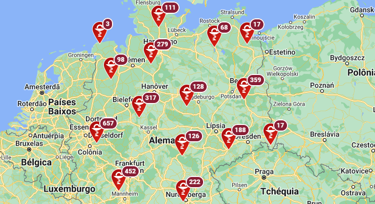


</details>

# 1. INTRODUÇÃO

Este relatório descreve um projeto de Ciência de Dados que consiste na criação de um **Algoritmo de Regressão** utilizando *machine learning* para previsão do faturamento de cada uma das lojas de uma rede farmacêutica. O projeto segue a metodologia CRISP-DM, garantindo uma abordagem estruturada e eficiente.

Resumindo, neste projeto fizemos uso das seguintes ferramentas e técnicas:

- **Ferramentas**: VS-Code, Jupyter Notebook, Mini Conda, GitHub, GPT-4
- **Programação & Bibliotecas**: Python, Pandas, Numpy, Scikit-Learn, Matplotlib, Seaborn
- **Modelos de Machine Learning**: Regressão Linear (simples & Lasso), Random Forest, XGBoost
- **Seleção de Features & Validação**: Boruta, Cross-Validation
- **Deployment & API**: API Flask, API Bot Telegram, hospedagem [Render.com](https://render.com/)

Os dados foram obtidos de uma competição no Kaggle, compreendendo mais de 1 milhão de registros de vendas de mais de mil lojas. Foram testados cinco algoritmos de aprendizado de máquina, e o XGBoost Regressor foi selecionado como o modelo final devido ao seu desempenho superior em métricas como MAE, MAPE e RMSE.

Os produtos finais estão listados na [Seção 3.1](#31-produto-final): (i) *insights* de negócio, (ii) modelo de *machine learning* e (iii) Robô-Telegram. Os detalhes quando aos resultados dos algoritmos estão apresentados a partir da [Seção 7](#7-resultado-ii-modelo-de-previs%C3%A3o).


# 2. A EMPRESA & O PROBLEMA DE NEGÓCIO

Conforme informa a [Wikipedia](https://en.wikipedia.org/wiki/Rossmann_(company))<sup>1</sup>, a empresa Rossmann, ou, mais especificamente, Dirk Rossmann GmbH, é uma cadeia de lojas farmacêuticas fundada em 1972 e sediada em Burgwedel, na Alemanha. No seu histórico de [maiores realizações](https://unternehmen.rossmann.de/ueber-uns/unsere-geschichte.html)<sup>2</sup>, a empresa ressalta os seguintes feitos somente em 2023:

1. Alcançou o 16º lugar na lista [Forbes](https://www.forbes.com/lists/worlds-best-employers/?sh=4a53ed2f1e0c) das melhores empresas do mundo para se trabalhar em 2023<sup>3</sup>, bem assim o 3º lugar entre as empresas na Alemanha.
2. Seus produtos passaram a fazer parte das mais de 1500 lojas das redes SPAR, EUROSPAR e INTERSPAR, com abrangência na Áustria, Hungria, Eslovênia, Croácia e norte da Itália.
3. Iniciou cooperação com a cadeia chinesa de supermercados FRESHIPPO, do Grupo Alibaba, passando seus produtos a serem encontrados em mais de 300 filiais FRESHIPPO naquele país asiático.

Atualmente, aos gerentes de loja é dada a tarefa de realizarem a previsão de suas vendas diárias para as próximos seis semanas. As vendas das lojas são influenciadas por muitos fatores, incluindo promoções, concorrência, feriados escolares e feriados estaduais, sazonalidades, e situações locais. Com milhares de gerentes individuais predizendo vendas com base em suas circunstâncias específicas, a acurácia dos resultados pode variar bastante.

Com o intuito de aprimorar as previsões, esta Equipe de Cientistas de Dados da Rossmann foi incumbida de desenvolver um modelo capaz de prever seis semanas de vendas diárias para um conjunto de 1.115 lojas localizadas na Alemanha. A motivação para o projeto está no fato de que a obtenção de previsões confiáveis de vendas permite que os gerentes de lojas criem planos efetivos para as equipes de trabalho, de modo a aumentar a produtividade e a motivação. Com a criação de um modelo de previsão robusto, será possível aos gerentes de loja permanecerem focados no que lhes é mais importante: seus consumidores e suas equipes de trabalho.

<i>Disclaimer</i>: o presente projeto se trata de um problema fictício, que toma por base o desafio "Rossmann Store Sales" publicado no [Kaggle](https://www.kaggle.com/competitions/rossmann-store-sales) em 2015<sup>4</sup>.


# 3. PLANEJAMENTO DA SOLUÇÃO

## 3.1. Produto Final

Conforme descrito no problema de negócio, o desafio da Equipe de Cientistas de Dados é desenvolver um modelo capaz de prever seis semanas de vendas diárias para um subconjunto de lojas da empresa Rossmann.

Assim, a solução apresentada compreende a entrega de três resultados:

1. <b><i>Insights</i> relacionados ao negócio</b>, a partir da análise dos dados fornecidos.
2. <b>Modelo de <i>machine learning</i></b> capaz de atender a demanda da empresa quanto à previsão de faturamento acumulado de suas lojas para as próximas seis semanas.
3. <b>Robô-Telegram</b> para permitir utilização de telefones celulares na consulta aos resultados das previsões de faturamento das lojas.

## 3.2. Estratégia de Solução

O trabalho foi realizado seguindo o método CRISP-DM (ou "<i>Cross Industry Standard Process for Data Mining</i>"), uma abordagem cíclica capaz de aprimorar a qualidade e agilizar a entrega de resultados em projetos de Ciência de Dados. O método pode ser resumido no seguinte conjunto de etapas:

1. Entendimento do negócio
2. Coleta, tratamento e modelagem dos dados
3. Algoritmos de <i>Machine Learning</i>
4. Avaliação dos resultados
5. Entrada em produção.


# 4. OS DADOS DISPONÍVEIS

Nesta seção busca-se compreender as peculiaridades dos dados existentes. Os dados disponíveis para os estudos de previsão são aqueles fornecidos pela empresa cliente em três arquivos: STORE.CSV, TRAIN.CSV e TEST.CSV.

<table align="center">
<tr><td>
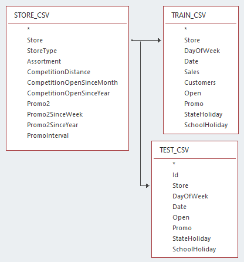
</td></tr>
</table>


A partir do planilhamento (excel) desses arquivos, é possível constatar várias características, conforme se descreve a seguir.

## 4.1. O Arquivo STORE.CSV

O arquivo STORE.CSV consiste num cadastro de lojas contendo 1.115 registros, com as informações relativas às características de cada loja a ser estudada. Suas 10 colunas trazem os seguintes atributos:

<table align="center">
  <tr>
    <th align="center">ATRIBUTO</th>
    <th>DESCRIÇÃO E OBSERVAÇÕES</th>
  </tr>
  <tr>
    <td align="center">Store</td>
    <td>Identificador único de cada loja. A tabela contém 1.115 lojas numeradas de 1 a 1.115, portanto, sem duplicidade.</td>
  </tr>
  <tr>
    <td align="center">StoreType</td>
    <td>Indica os tipos de lojas. A base contém 4 tipos: <b>A</b> (602 lojas), <b>B</b> (17), <b>C</b> (148) e <b>D</b> (348).</td>
  </tr>
  <tr>
    <td align="center">Assortment</td>
    <td>(Sortimento) indica o nível de variedade do estoque, sendo: <b>A</b> = básico (593 lojas), <b>B</b> = extra (9), <b>C</b> = estendido (513).</td>
  </tr>
  <tr>
    <td align="center">CompetitionDistance</td>
    <td>Distância em metros do concorrente mais próximo.</td>
  </tr>
  <tr>
    <td align="center">CompetitionOpenSince [Month/Year]</td>
    <td>São duas colunas indicando o ano e o mês aproximado em que o concorrente mais próximo foi aberto.</td>
  </tr>
  <tr>
    <td align="center">Promo2</td>
    <td>É uma promoção contínua e consecutiva para algumas lojas. O atributo apresenta os seguintes valores: <b>1</b> = a loja está participando do programa Promo2 (571 lojas), <b>0</b> = a loja não está participando da Promo2 (544 lojas).</td>
  </tr>
  <tr>
    <td align="center">Promo2Since [Year/Week]</td>
    <td>São duas colunas indicando o ano e a semana em que a loja começou a participar da Promo2.</td>
  </tr>
  <tr>
    <td align="center">PromoInterval</td>
    <td>Indica os intervalos mensais consecutivos em que a promoção 'Promo2' é iniciada, com indicação dos meses em que a promoção é reiniciada. Por exemplo, "fev, maio, agosto, novembro" significa que cada rodada começa em fevereiro, maio, agosto e novembro de qualquer ano para aquela loja.</td>
  </tr>
</table>


(Fonte: [Kaggle](https://www.kaggle.com/competitions/rossmann-store-sales), Rossmann Store Sales<sup>4</sup>)

Numa primeira inspeção do arquivo STORE.CSV, observa-se que as lojas podem ser cadastradas em um entre quatro tipos (store_type = A, B, C ou D) - e podem ser cadastradas em um entre três tipos de sortimentos (assortment: A=basic, B=extra, ou C=extended). Assim, o quantitativo de lojas por <b>tipos+sortimentos</b> é o seguinte:

<table align="center">
    <tr>
        <td colspan=2 rowspan=2 align="center"><b>Quantidade</b></td>
        <td colspan=4 align="center"><b>store_type</b></td>
        <td rowspan=2><b>TOTAL</b></td>
    </tr>
    <tr>
        <td align="center"><b>A</b></td>
        <td align="center"><b>B</b></td>
        <td align="center"><b>C</b></td>
        <td align="center"><b>D</b></td>
    </tr>
    <tr>
        <td rowspan=3><b>assortment</b></td>
        <td><b>A=basic</b></td>
        <td align="center">381</td>
        <td align="center">7</td>
        <td align="center">77</td>
        <td align="center">128</td>
        <td align="center"><b>593</b></td>
    </tr>
    <tr>
        <td><b>B=extra</b></td>
        <td align="center">-</td>
        <td align="center">9</td>
        <td align="center">-</td>
        <td align="center">-</td>
        <td align="center"><b>9</b></td>
    </tr>
    <tr>
        <td><b>C=extended</b></td>
        <td align="center">221</td>
        <td align="center">1</td>
        <td align="center">71</td>
        <td align="center">220</td>
        <td align="center"><b>513</b></td>
    </tr>
    <tr>
        <td colspan=2 align="center"><b>TOTAL</b></td>
        <td align="center"><b>602</b></td>
        <td align="center"><b>17</b></td>
        <td align="center"><b>148</b></td>
        <td align="center"><b>348</b></td>
        <td align="center"><b>1.115</b></td>
    </tr>
</table>

Nessa tabela, algums aspectos chamam a atenção. Quanto ao tipo de loja, tem-se que:
- A quase totalidade das lojas (85%) está entre os tipos A (602) e D (348).
- Os demais 15% de lojas  - tipos B e C - participam em percentuais de 1,5% (B) e 13,3% (C) de toda a rede.

Ao juntar a informação de sortimento, observa-se que:
- No conjunto de lojas do tipo A predomina o sortimento do tipo "basic"
- No conjunto de lojas do tipo D predomina o sortimento do tipo "extended"
- Só há nove lojas com sortimento do tipo "extra", e todas são lojas do tipo B. Logo, não há lojas de tipos A, C ou D e que tenham sortimento do tipo "extra"


## 4.2. O Arquivo TRAIN.CSV

O arquivo TRAIN.CSV possui pouco mais de um milhão de linhas, com informações de caráter temporal, ou seja, dados do histórico diário de vendas de cada loja. O conjunto de dados contém os seguintes nove atributos:

<table align="center">
  <tr>
    <th align="center">ATRIBUTO</th>
    <th>DESCRIÇÃO</th>
  </tr>
  <tr>
    <td align="center">Store</td>
    <td>Chave estrangeira indicadora de cada loja (de 1 a 1.115).</td>
  </tr>
  <tr>
    <td align="center">DayOfWeek</td>
    <td>Dia da semana, contendo valores numéricos de <b>1 (segunda-feira)</b> a <b>7 (domingo)</b>.</td>
  </tr>
  <tr>
    <td align="center">Date</td>
    <td>O dia em que as vendas ocorreram. Os valores vão de <b>01/01/2013 a 31/07/2015</b>.</td>
  </tr>
  <tr>
    <td align="center">Sales</td>
    <td>Volume de vendas do dia.</td>
  </tr>
  <tr>
    <td align="center">Customers</td>
    <td>Número de clientes desse dia.</td>
  </tr>
  <tr>
    <td align="center">Open</td>
    <td>Indicador se a loja está <b>fechada (0) ou aberta (1)</b> nessa data.</td>
  </tr>
  <tr>
    <td align="center">Promo</td>
    <td>Indica se a loja está fazendo uma <b>promoção esporádica</b> naquele dia.</td>
  </tr>
  <tr>
    <td align="center">StateHoliday</td>
    <td>Indica <b>feriado estadual</b>. Normalmente, as lojas fecham nos feriados estaduais. Todas as escolas fecham em feriados públicos e fins de semana. Possíveis valores: <b>A = feriado público, B = feriado de Páscoa, C = Natal, 0 = não é feriado</b>.</td>
  </tr>
  <tr>
    <td align="center">SchoolHoliday</td>
    <td><b>Feriado escolar</b>. Indica se o registro (<b>Loja + Data</b>) foi afetado pelo fechamento de escolas públicas.</td>
  </tr>
</table>


(Fonte: [Kaggle](https://www.kaggle.com/competitions/rossmann-store-sales), Rossmann Store Sales<sup>4</sup>)

Nessa tabela, do total de 1.017.209 registros diários, tem-se 844.392 (83%) nos quais as lojas estava abertas.

Observa-se também a existência de um campo 'promo', o que permite o registro de um dia avulso de promoção. Ou seja, é diferente de 'promo2', que representa um programa estruturado para promoções mensais.

Ao final, os dados a serem utilizados no presente projeto resultam da junção das informações dos arquivos STORE.CSV e TRAIN.CSV.


## 4.3. O Arquivo TEST.CSV

O arquivo TEST.CSV possui pouco mais de 40 mil registros referentes a 856 lojas, com informações relativas ao movimento diário do período de 01-agosto a 17-setembro-2015. Não estão disponíveis as informações de volume diário de vendas ('sales') nem de quantidade de clientes por dia ('customers').

No presente projeto, o arquivo TEST.CSV tem seus dados utilizados na etapa de previsão em tempo real por meio do aplicativo ROBÔ-TELEGRAM, descrito no tópico 8.

O arquivo contém os seguintes atributos:

<table align="center">
  <tr>
    <th align="center">ATRIBUTO</th>
    <th>DESCRIÇÃO</th>
  </tr>
  <tr>
    <td align="center">Id</td>
    <td>Identificador representativo de <b>Loja + Data</b>.</td>
  </tr>
  <tr>
    <td align="center">Store</td>
    <td>Identificador único de cada loja.</td>
  </tr>
  <tr>
    <td align="center">DayOfWeek</td>
    <td>Dia da semana, contendo valores numéricos de <b>1 (segunda-feira)</b> a <b>7 (domingo)</b>.</td>
  </tr>
  <tr>
    <td align="center">Date</td>
    <td>Data à qual o registro se refere. Os valores vão de <b>01/08/2015 a 17/09/2015</b>.</td>
  </tr>
  <tr>
    <td align="center">Open</td>
    <td>Indicador se a loja está <b>fechada (0) ou aberta (1)</b>.</td>
  </tr>
  <tr>
    <td align="center">Promo</td>
    <td>Indica se a loja está fazendo uma <b>promoção</b> naquele dia.</td>
  </tr>
  <tr>
    <td align="center">StateHoliday</td>
    <td>Indica <b>feriado estadual</b>. Normalmente, as lojas fecham nos feriados estaduais. Todas as escolas fecham em feriados públicos e fins de semana. Possíveis valores: <b>A = feriado público, B = feriado de Páscoa, C = Natal, 0 = não é feriado</b>.</td>
  </tr>
  <tr>
    <td align="center">SchoolHoliday</td>
    <td><b>Feriado escolar</b>. Indica se o registro (<b>Loja + Data</b>) foi afetado pelo fechamento de escolas públicas.</td>
  </tr>
</table>


(Fonte: [Kaggle](https://www.kaggle.com/competitions/rossmann-store-sales), Rossmann Store Sales<sup>4</sup>)


# 5. PREPARAÇÃO DOS DADOS

Descreve-se a seguir o tratamento realizado na base de dados para prepará-la para aplicação dos algoritmos de <i>machine learning</i>.

## 5.1. Tratamento dos NaN

NaN é o acrônimo para "<i>not a number</i>" e representa um valor faltante ou não definido no <i>dataframe</i>. Na base de dados deste projeto foram tratadas as ocorrências de NaN nas seguintes <i>features</i>:

- <b>competition_distance</b>: substituídos os NaN por uma distância bastante grande (200.000)
- <b>competition_open_since_month</b>: substituídos pelo mês constante da variavel 'date'
- <b>competition_open_since_year</b>: substituídos pelo ano constante da variavel 'date'
- <b>promo2_since_week</b>: substituídos pela semana referente à variavel 'date'
- <b>promo2_since year</b>: substituídos pelo ano constante da variavel 'date'
- <b>promo_interval</b>: os NaN foram substituídos por zero.

Há possibilidade de, em próximos aperfeiçoamentos, testar a utilização de outros critérios para substituição dos NaN. Uma possibilidade seria utilizar um algoritmo de <i>Random Forest</i> para preencher esses valores, com base nos demais casos da base de dados. Outra possibilidade seria utilizar o algoritmo K-means para clusterização dos dados e, então, preencher os dados faltantes com os valores médios de cada cluster.


## 5.2. Feature engineering

A partir dos dados originais (descritos no tópico 4, acima), foram derivadas novas <i>features</i> capazes de retratar:

- o programa de promoções continuadas (promo2),
- a presença de outros concorrentes de mercado (competition),
- as sazonalidades semanais, mensais e outras,
- a ocorrência de feriados de diversos tipos, e
- a medição de faturamento por cliente.

Vamos aos detalhes:

<b>PROMO2</b>: Os dados mostram que o programa de promoções continuadas é característica intrínseca a cada loja, haja vista se tratar de informação cadastral contida no arquivo STORE.CSV (tópico 4.1). Um total de 571 lojas participam do programa. Cada loja traz sua informação de data em que iniciou sua participação no programa ("promo2since_week" e "promo2since_year"). Além disso, cada loja participa do programa em determinados 4 meses do ano, da seguinte forma:

<table align="center">
    <tr>
        <td align="center"><b>PERÍODO QUADRIMESTRAL</b></td>
        <td align="center"><b>Número de Lojas</b></td>
    </tr>
    <tr>
        <td align="center">Jan,Apr,Jul,Oct</td>
        <td align="center">335 (59%)</td>
    </tr>
    <tr>
        <td align="center">Feb,May,Aug,Nov</td>
        <td align="center">130 (23%)</td>
    </tr>
    <tr>
        <td align="center">Mar,Jun,Sept,Dec</td>
        <td align="center">106 (19%)</td>
    </tr>
    <tr>
        <td align="center"><b>TOTAL</b></td>
        <td align="center"><b>571 (100%)</b></td>
    </tr>
</table>

Para retratar a dinâmica do progrma de promoções, foram elaboradas as <i>features</i>:
- is_promo2: valor 0 ou 1, indicando se, no dia, a loja está no programa,
- promo2_time_week: quantidade de semanas desde que a loja ingressou no programa.

A figura retrata as novas features e sua evolução no tempo para o caso da loja nº 28:

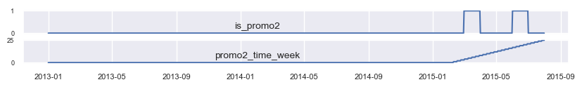


<b>COMPETITION</b>: o cadastro das empresas traz informação quanto à existência de concorrentes, informando a data em que surgiram e a distância entre a loja e seu concorrente mais próximo. A partir daí, foram elaboradas as <i>features</i>:
- has_competition: valor 0 ou 1, indicando se já consta concorrência naquele dia.
- competition_time_month: número de meses desde que se iniciou a concorrência.

A figura retrata essas features e sua evolução no tempo para o caso da loja nº 14:


<b>OUTRAS <i>FEATURES</i></b>:

- SAZONALIDADES: a partir do campo 'data' foram criadas <i>features</i> indicativas de: ano, mês, dia, semestre, trimestre, bimestre, quinzena do mês, quinzena do ano e semana do ano. 
- ASSORTMENT: os valores foram trocados, de A B C para "basic", "extra", "extended".
- STATE_HOLIDAY: os valores relativos aos feriados foram trocados, de 0 A B C, para "regular_day", "public_holiday", "easter_holiday", "christmas".
- FATURAMENTO POR CLIENTE: foi criada a <i>feature</i> 'sales_per_customer', indicando a relação sales/customers para o faturamento diário de cada loja.

OBS: esta <i>feature</i> teve papel importante na etapa de análise do negócio, não sendo levada à etapa de <i>machine learning</i> por restrição do negócio.


## 5.3. Normalização da variável alvo

A variável alvo é 'sales' (volume de vendas do dia), informação disponível no arquivo TRAIN.CSV (tópico 4.2). Por inspeção, constata-se a existência de assimetria positiva. 

Nesses casos, a literatura (por exemplo, Aurelién Géron<sup>5</sup>, pg. 76-77) sugere a aplicação de correção por meio de utilização da função raiz quadrada ou, para assimetrias mais intensas, a função logarítmica.

A figura mostra a distribuição original, bem assim as transformações citadas.

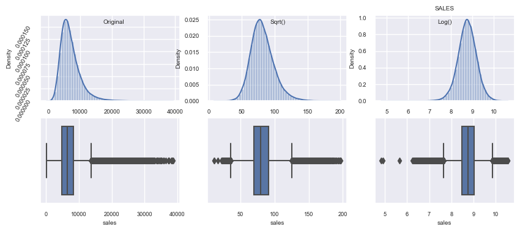

Por inspeção desses resultados, optou-se pelo uso da transformação logarítmica.


## 5.4. Transformação e reescalonamento de variáveis numéricas

O reescalonamento de variáveis numéricas tem por objetivo levar todas essas variáveis a terem uma excursão de fundo de escala semelhantes, por exemplo, entre 0 e 1. Três variáveis foram avaliadas para fins de reescalonamento e transformação: promo2_time_week, competition_distance e competition_time_month.

<b>PROMO2_TIME_WEEK</b>: essa variável contém grande número de ocorrências em zero, devido às datas anteriores à de entrada da loja na promoção 'promo2', conforme já mostrado em figura anterior (tópico 5.2). Isso traz distorção para o histograma (figura abaixo). Ao serem desconsiderados esses pontos em zero, é possível verificar que a distribuição dos demais pontos se mantém relativamente uniforme.

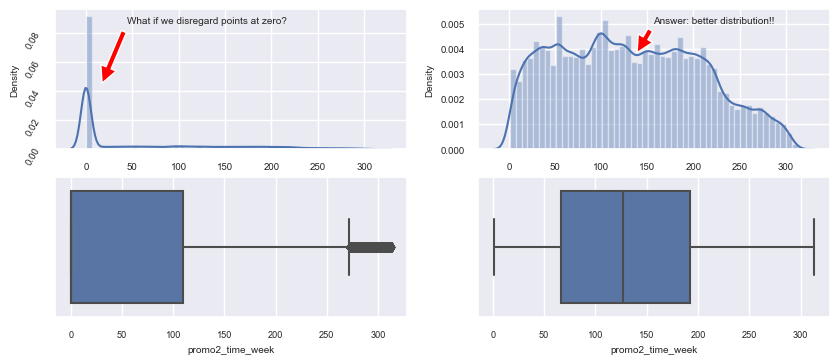

Assim, dada a relativa uniformidade da distribuição, entendemos não ser necessária a transformação logarítmica ou de raiz quadrada, mas tão somente o escalonamento min-max.


<b>COMPETITION_DISTANCE</b>: por inspeção, constata-se a existência de assimetria positiva em sua distribuição original. Há também uma concentração de pontos na distância de 200.000, devido ao tratamento de NaNs (tópico 5.1). A figura abaixo mostra a distribuição original e as transformações de raiz quadrada e logarítmica.


Por inspeção desses resultados, optou-se pelo uso da transformação logarítmica e, a partir daí, o reescalonamento min-max.


<b>COMPETITION_TIME_MONTH</b>: tal como no caso de 'promo2_time_week', esta variável também contém grande número de ocorrências em zero, devido às datas anteriores à de surgimento de competidores, conforme pode ser visto no tópico 5.2. A figura abaixo apresenta a distribuição original e as transformações de raiz quadrada e logarítmica, sendo evidente a superioridade dessa última transformação. 


Ao serem desconsiderados os pontos em zero (figura abaixo), é possível uma melhor visualização da distribuição da variável.


Por inspeção desses resultados, optou-se pelo uso da transformação logarítmica e, a partir daí, o reescalonamento min-max.


## 5.5. Transformação de variáveis categóricas

As variáveis categóricas 'state_holiday', 'store_type' e 'assortment' receberam o seguinte tratamento:

- 'state_holiday': one hot encoding
- 'store_type': label encoding
- 'assortment': ordinal encoding

Por sua vez, as variáveis representativas de dados sazonais, por possuírem natureza circular, receberam codificação trigonométrica<sup>6, 7</sup>. Essa codificação foi aplicada às variáveis: dia, mês, semana do ano, dia da semana, trimestre, bimestre, e quinzena do ano.

## 5.6. Importância relativa das variáveis

Segundo a literatura (Géron<sup>5</sup>, pg. 221), uma qualidade da <i>random forest</i> é sua capacidade de medir a importância relativa de cada <i>feature</i>. Assim, com essa técnica, foi possível aferir a seguinte importância relativa das variáveis disponíveis, conforme mostrado no gráfico:

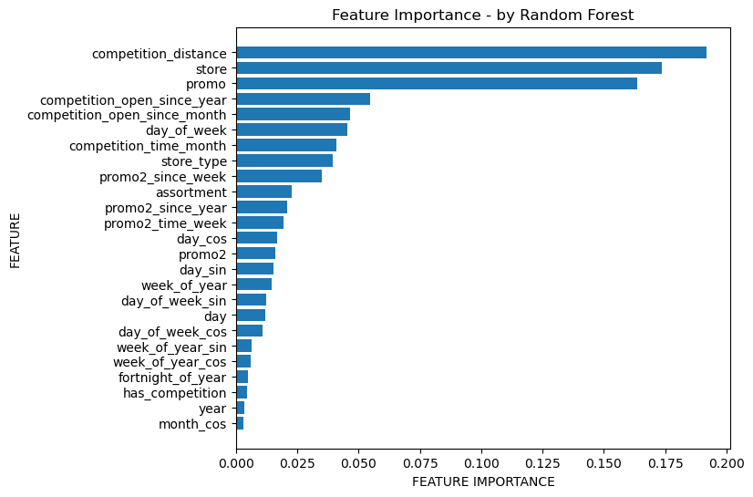


## 5.7. Correlação entre variáveis categóricas

Por meio da correlação de Cramer é possível estimar a correlação entre variáveis categóricas. A figura a seguir mostra a correlação existente para as variáveis constante da base de dados sob análise.


Nessa figura, as cores parecem indicar a existência de quatro quadrantes. Isso pode ser explicado pelo fato de, nesse gráfico, as primeiras variáveis serem informações trazidas do arquivo TRAIN.CSV, ou seja, são informações de caráter temporal. Por sua vez, as últimas variáveis se originam do arquivo STORE.CSV, sendo portanto informações cadastrais das lojas, e que não variam no tempo.

# 6. RESULTADO-I: PRINCIPAIS <i>INSIGHTS</i> DE NEGÓCIO

O processo de criação de <i>insights</i> relacionados ao fenômeno de vendas diárias das lojas iniciou-se por um <i>brainstorming</i> para mapeamento das características do negócio. Para isso, foram levados em conta os atributos relacionados às lojas, sua localização, produtos, clientes e aspectos relativos ao calendário. A ideia pode ser visualizada a partir do seguinte mapa mental:

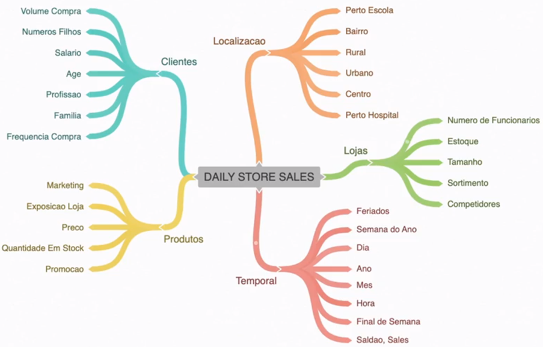

A partir deste mapa, foram elaboradas diversas hipóteses. Abaixo estão listadas as hipóteses submetidas a pesquisa numérica:

1. Lojas com concorrentes há mais tempo vendem mais
2. Lojas com concorrentes próximos tendem a vender menos
3. Lojas com produtos de baixo custo (ex: sortimento "extra") vendem menos do que lojas com produtos mais caros (ex: sortimento "extended")
4. Lojas com produtos de baixo custo têm mais clientes enquanto lojas com produtos mais caros têm menos clientes
5. A maior parte das lojas trabalham com produtos de baixo custo
6. Lojas com promoções por mais tempo devem vender mais
7. Lojas com mais promoções consecutivas devem vender mais
8. Lojas abertas durante o feriado de Natal devem registrar maiores vendas
9. Lojas devem vender menos nos feriados escolares, dada a redução no número de clientes
10. Lojas devem também vender menos nos demais feriados, dada a redução no número de clientes
11. Lojas devem vender mais nos dias de 2ª feira, visto terem as lojas estado fechadas no dia anterior
12. Aos domingos, as poucas lojas abertas devem vender mais
13. Aos sábados as lojas devem vender menos, dada a redução no horário do expediente
14. Devido ao dia das mães, o mês de Maio deve ser o 2º melhor mês do ano em vendas
15. Devido ao inverno, Janeiro e Fevereiro devem vender menos
16. Lojas devem vender mais entre os dias finais de um mês e os dias iniciais do mês seguinte, em função do recebimento de salários na economia
17. Lojas devem vender menos nos dias intermediários de cada mês.

Como resultado da análise da base de dados, foi possível chegar às seguintes principais constatações:

## Insight nº 1: Lojas com concorrentes há mais tempo vendem mais
Hipótese <b>FALSA</B>: Lojas com concorrentes a mais tempo vendem menos


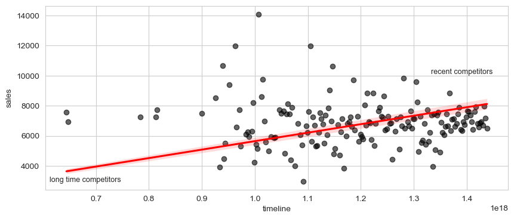

## Insight nº 2: Lojas com produtos de baixo custo faturam menos do que lojas com produtos mais caros
Hipótese <b>FALSA</B>: Lojas com produtos de baixo custo faturam mais

Conforme mostram os gráficos abaixo, as lojas com sortimento do tipo "extra" são as que apresentam o <b>menor valor</b> de venda por cliente, indicando se tratarem de produtos de baixo custo. No entanto, tais lojas têm quase <b>o triplo de clientes</b> das demais lojas, resultando em maior faturamento médio diário.

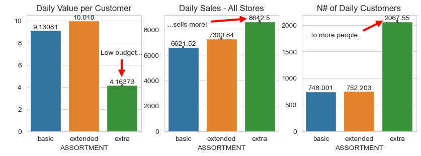

Conclui-se assim que as lojas com produtos de baixo custo vendem mais e para mais clientes.

## Insight nº 3: Lojas com promoções por mais tempo devem vender mais
Hipótese <b>FALSA</B>: Lojas com promoções por mais tempo vendem menos

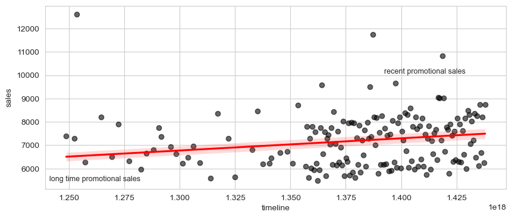

Além disso, os dados revelam que, em média, na maioria dos dias ao longo de um mês, as lojas sem promoção faturam mais do que as lojas participantes de promoção. De acordo com o gráfico abaixo, as vendas em promoção (laranja) superam as vendas normais (azul) apenas entre os dias 6 e 15 de cada mês.


O gráfico acima permite outra constatação. Observando os dias de alta demanda, por exemplo, os dias 2, 18 e 30, percebe-se que a realização de promoções nesses dias resulta em redução do faturamento.

Ou seja: os dados parecem indicar que não é boa ideia realizar promoções em dias de alta demanda.

## Insight nº 4: Lojas abertas durante o feriado de Natal devem registrar maiores vendas
Hipótese <b>VERDADEIRA</B>: Os dados mostram que, em média, ocorrem mais vendas no feriado de Natal e nos demais feriados, se comparados com o valor vendido em um dia regular.


## Insight nº 5: Lojas devem vender mais nos dias de 2ª feira, visto terem as lojas estado fechadas no dia anterior
Hipótese <b>VERDADEIRA</B>: Os dados mostram que, em média, as lojas atendem mais clientes e têm maior faturamento na 2ª feira.

<table align="center">
    <tr>
        <td align="center"><b>DIA</b></td>
        <td align="center"><b>Lojas Abertas</b></td>
        <td align="center"><b>Vendas (avg)</b></td>
        <td align="center"><b>Clientes (avg)</b></td>
        <td align="center"><b>Vendas/Cliente</b></td>
    </tr>
    <tr>
        <td>1 Segunda</td>
        <td align="center">1.115</td>
        <td align="center">8.216,25</td>
        <td align="center">855,46</td>
        <td align="center">9,62</td>
    </tr>
    <tr>
        <td>2 Terça</td>
        <td align="center">1.115</td>
        <td align="center">7.088,41</td>
        <td align="center">770,02</td>
        <td align="center">9,31</td>
    </tr>
    <tr>
        <td>3 Quarta</td>
        <td align="center">1.115</td>
        <td align="center">6.728,79</td>
        <td align="center">740,67</td>
        <td align="center">9,24</td>
    </tr>
    <tr>
        <td>4 Quinta</td>
        <td align="center">1.115</td>
        <td align="center">6.768,21</td>
        <td align="center">755,67</td>
        <td align="center">9,11</td>
    </tr>
    <tr>
        <td>5 Sexta</td>
        <td align="center">1.115</td>
        <td align="center">7.073,03</td>
        <td align="center">781,81</td>
        <td align="center">9,19</td>
    </tr>
    <tr>
        <td>6 Sábado</td>
        <td align="center">1.115</td>
        <td align="center">5.875,08</td>
        <td align="center">660,21</td>
        <td align="center">9,13</td>
    </tr>
    <tr>
        <td>7 Domingo</td>
        <td align="center">33</td>
        <td align="center">8.224,72</td>
        <td align="center">1.441,53</td>
        <td align="center">6,19</td>
    </tr>
</table>


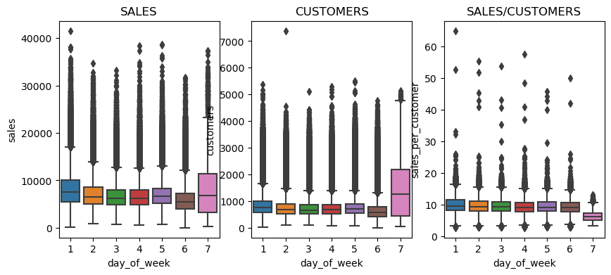

As informações da tabela acima indicam também que:

1. Nas <b>segundas-feiras</b> o valor de vendas por cliente são, em média, os mais altos da semana. O faturamento por loja é também o mais alto da semana, empatando com o domingo. Além disso, há elevado número de clientes nas segundas-feiras.
2. Os dias de <b>domingo</b> diferem dos demais pelo fato de contarem com no máximo 33 lojas abertas. Importante observar que essas 33 lojas devem estar preparadas para receber aproximadamente o dobro do total de clientes recebidos nos demais dias da semana. O faturamento é alto aos domingos e as vendas se concentram em produtos de baixo custo.
3. Os dias de <b>sábado</b> são os de faturamento mais baixo por loja, ocorrendo reduzido número de clientes. Essa situação pode ser explicada pelo expediente reduzido aos sábados, indo das 9 horas da manhã até as 13 horas, conforme indica o [site de informações da cidade de Bonn](https://www.bonn.de/microsite/en/services/medical-care/index.php).


## Insight nº 6: Devido ao dia das mães, o mês de Maio deve ser o 2º melhor mês do ano em vendas
Hipótese <b>FALSA</B>: O mês de Maio é o 3º melhor em vendas, superado em 1º  lugar por Dezembro (Natal) e em 2º lugar por Novembro (black friday)

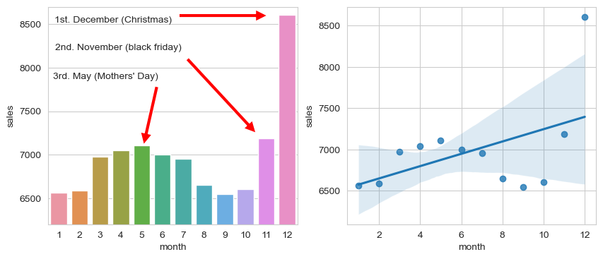

Nesse exemplo, os dados contradizem uma crença amplamente aceita, de que o Dia das Mães seria o segundo melhor período de vendas do ano, e que ficaria atrás apenas do período de Natal.

# 7. RESULTADO-II: MODELO DE PREVISÃO

O trabalho de construção do modelo de <i>machine learning</i> foi dividido nas seguintes etapas:
1. busca pelo algoritmo capaz de apresentar o melhor desempenho, ou menor erro. Para isso, foram testados diversos diferentes algoritmos de <i>machine learning</i>, configurados com os hiperparâmetros em seus valores-padrão.
2. utilização do algoritmo eleito na etapa anterior e otimização dos seus hiperparâmetros para se chegar ao modelo definitivo.
3. interpretação do erro sob três aspectos: (i) desempenho de negócio, (ii) desempenho total, e (iii) desempenho do modelo de <i>machine learning</i>


## 7.1. Algoritmos de <i>Machine Learning</i>

Numa primeira etapa, os seguintes algoritmos foram testados:

- Média simples por loja
- Regressão Linear
- Regressão Linear regularizada - Lasso
- Regressor Floresta Randômica
- Regressor XGBoost

Para tanto, a base de dados foi dividida em dois grupos, de treino e teste, com o seguinte critério:
- Base de Treino: utilizada para os ensaios de <i>cross-validation</i>, contendo todos os registros, desde a data inicial, 01-01-2013, até seis semanas antes da data final, ou seja, até 18-06-2015.
- Base de Teste: contendo os registros das seis semanas finais, ou seja, de 19-06-2015 a 31-07-2015. Base guardada para o teste final de desempenho.


Como resultado, o seguinte desempenho foi obtido para cada algoritmo:

| MODELO  | Média Simples | Random Forest    | XGBoost          | Regressão Linear | Regressão Linear Lasso |
|---------| :-----------: | :----------------| :----------------|  :---------------| :----------------------|
| MAE     |   1354.800    | 667.062          | 712.573          | 1871.765         | 1891.158         |
| MAE CV  |  -            | 855.26+/-251.27  | 952.02+/-196.35  | 2084.42+/-275.17 | 2118.94+/-340.39 |
| MAPE    |     0.206     | 0.099            | 0.103            | 0.297            | 0.289            | 
| MAPE CV | -             | 0.12+/-0.03      | 0.13+/-0.02      | 0.31+/-0.02      | 0.29+/-0.01      | 
| RMSE    |  1835.136     | 1015.273         | 1029.747         | 2659.116         | 2746.044         | 
| RMSE CV | -             | 1292.31+/-391.93 | 1363.02+/-272.64 | 2938.95+/-445.8  | 3062.87+/-502.05 | 

Como se pode observar, o algoritmo RANDOM FOREST foi o que trouxe o melhor resultado, seguido de perto pelo algoritmo XGBOOST. Deste modo, considerando os limites existentes em termos de memória necessária na nuvem para colocar o modelo em produção, optou-se pelo modelo XGBOOST para a versão final do projeto.

A partir daí, prosseguiu-se com a otimização dos hiperparâmetros, que resultaram em:

| n_estimators | max_depth | subsample | min_child_weight | colsample_bytee |  eta |
| :----------: | :-------: | :-------: | :--------------: | :-------------: |------|
| 1000         | 5         | 0.8       | 15               | 0.3             | mantido valor <i>default</i> |

Ao final, foi treinado o modelo utilizando toda a base de Treino (de 01-01-2013 a 18-06-2015). Testado este modelo com uso da base de Teste (de 19-06 a 31-07-2015), obteve-se o seguinte resultado:

- MAE = 673.001
- MAPE = 9.93%
- RMSE = 972.61


## 7.2. Interpretação do erro

Utilizando o modelo treinado, realizamos a previsão de vendas diárias de todas as lojas para cada dia das últimas seis semanas (de 19-junho a 31-julho-2015), sendo então apurado o desempenho de cada loja, bem assim os limites máximo e mínimo de erro esperado, da seguinte forma:

- <b>Previsão da loja</b>: somatório do faturamento diário em seis semanas
- <b>Pior caso da loja</b>: previsão - (número de dias) * (erro médio absoluto para a loja)
- <b>Melhor caso da loja</b>: previsão + (núm. de dias) * (erro médio absoluto para a loja)

Por fim, fez-se a interpretação do desempenho do modelo e seu erro segundo três enfoques, apresentados a seguir.

### 7.2.1. Desempenho Total

O desempenho total do negócio foi obtido pela soma do faturamento de todas as lojas ao longo das seis semanas, obtendo-se como resultado:

<table>
    <tr>
        <td align="left">Previsão Total</td>
        <td align="right">R$ 287.462.400,00</td>
    </tr>
    <tr>
        <td align="left">Pior Caso</td>
        <td align="right">R$ 259.602.862,81</td>
    </tr>
    <tr>
        <td align="left">Melhor Caso</td>
        <td align="right">R$ 315.321.945,14</td>
    </tr>
</table>


### 7.2.2. Desempenho de Negócio

Para apurar o desempenho do negócio por loja de modo conservador, fez-se uso da medida de <b>Pior Caso da Loja</b>, ou seja, a previsão de faturamento da loja deduzida do erro esperado (MAE).

A título de exemplo, as seguintes lojas apresentaram os maiores valores de erro MAPE:

| Loja | Previsão de vendas | Pior caso  | Melhor caso |   MAE    |   MAPE   |
| :--: | :----------------: |-------:    |-----------: |-------:  |--------: |
| 909  | 245,993.23         | 68,956.04  | 423,030.46  | 7,697.27 | 0.54    |
| 292  | 108,814.39         | 50,542.50  | 167,086.30  | 3,066.94 | 0.53    |
| 595  | 357,363.53         | 185,514.01 | 529,212.99  | 4,644.58 | 0.32    |

Por sua vez, os menores valores para o erro MAPE foram os seguintes: 

| Loja | Previsão de vendas | Pior caso  | Melhor caso |  MAE   |   MAPE   |
| :--: | :----------------: |-------:    |-----------: |-----:  |--------: |
| 990  | 233,869.36         | 224,398.75 | 243,339.96  | 255.96 | 0.04    |
| 259  | 556,805.56         | 530,229.91 | 583,381.22  | 618.04 | 0.05    |
| 1089 | 382,206.88         | 362,627.96 | 401,785.79  | 529.16 | 0.05    |

A distribuição do percentual de erro por loja - o erro MAPE - é retratado na figura a seguir.


### 7.2.3. Desempenho do Modelo de <i>Machine Learning</i>

Para avaliação do desempenho do modelo de <i>machine learning</i> fez-se a comparação das predições diárias de todas as lojas no período de 19-06 a 31-07-2015 com os valores das vendas conhecidas para esse mesmo período. O resultado é mostrado nos gráficos a seguir.


O primeiro gráfico traz a plotagem das duas curvas - vendas e predições - permitindo conferir sua proximidade por inspeção.

O segundo gráfico, em forma de sino, resulta da diferença algébrica entre vendas e predições, mostrando que a maioria das ocorrências se situam em torno de zero e indicando a existência de situações em que as duas grandezas diferem.

A terceira plotagem é da razão [predição / vendas], sendo superior à unidade quando as predições superam as vendas, e vice-versa, conforme sinalizado no gráfico.


# 8. RESULTADO-III: O ROBÔ-TELEGRAM

O robô-telegram é uma ferramenta desenvolvida com a finalidade permitir aos gestores a utilização de seus telefones celulares para consulta aos valores de previsão de vendas para as lojas da rede Rossmann, conferindo assim a máxima funcionalidade e rapidez no acesso às informações gerenciais.

Para acesso ao robô-telegram, clique no link: https://t.me/mlmm_rossmann_bot.

Nas duas seções seguintes são apresentados: (i) o resumo do projeto, e (ii) o manual de utilização do robô.

## 8.1. O Projeto do Robô-Telegram

O robô-telegram é uma ferramenta para acesso às previsões de faturamento das lojas Rossmann. Assim, conforme ilustra a figura, o usuário pode interagir com o robô por meio do aplicativo Telegram em seu telefone celular, usando um conjunto de comandos para assim obter as informações gerenciais de que necessita.


A estrutura do robô inclui a utilização de duas API (acrônimo para <i>Application Programming Interface</i>) responsáveis:

- (i) pela "interface homem-máquina" e
- (ii) pela execução em tempo real do modelo de <i>machine learning</i> para previsão de faturamento das lojas.

A primeira interface - ROSSMANN API - contém a interação com o aplicativo Telegram e o código para análise e resposta aos comandos enviados pelo usuário. Caso seja identificado o comando de usuário para fornecimento da previsão de faturamento de uma loja, ou de um rol de lojas, então a API ROSSMANN encaminha comando de acionamento da interface para execução dos cálculos de previsão.

A segunda interface - <i>MACHINE LEARNING</i> API - executa a máquina de previsão a partir de comando enviado pela API ROSSMANN. A interação entre as duas API é iniciada pela remessa de um conjunto de dados de entrada para a máquina de previsão, no seguinte formato em JSON (exemplo para a loja 14):

```
[
  {
    "Store": 14,
    "DayOfWeek": 4,
    "Date": "2015-09-17",
    "Open": 1.0,
    "Promo": 1,
    "StateHoliday": "0",
    "SchoolHoliday": 0,
    "StoreType": "a",
    "Assortment": "a",
    "CompetitionDistance": 1300.0,
    "CompetitionOpenSinceMonth": 3.0,
    "CompetitionOpenSinceYear": 2014.0,
    "Promo2": 1,
    "Promo2SinceWeek": 40.0,
    "Promo2SinceYear": 2011.0,
    "PromoInterval": "Jan,Apr,Jul,Oct"
  },
  {
    "Store": 14,
    "DayOfWeek": 4,
    "Date": "2015-09-16", (...)
]
```

Recebidos os dados referentes a vários dias, a máquina os submete ao algoritmo de <i>machine learning</i> e obtém as previsões de valores de vendas para cada dia. Esses dados são reunidos em formato JSON e encaminhados de volta para a API solicitante. Esses dados retornam no seguinte formato:

```
[{'store': 14,
  'day_of_week': 4,
  'date': '2015-09-17T00:00:00.000',
  'open': 1.0,
  (...)
  'week_of_year': 38,
  'year_week': '2015-37',
  'prediction': 6027.00390625},  <<--- previsão
 {'store': 14,
  'day_of_week': 3,
  'date': '2015-09-16T00:00:00.000', (...)
```

Com o retorno do rol de previsões diárias, a API ROSSMANN faz a totalização para o período de seis semanas e retorna essa informação para o usuário.

## 8.2. Manual de Utilização

Após ter obtido o acesso ao Robô-Telegram por meio do [link](https://t.me/mlmm_rossmann_bot) apropriado, o seguinte conjunto de comandos estão disponíveis para o usuário:

### COMANDO: OI ou HI ou HELLO
- Resultado: acorda o robô e permite obter mensagem de boas vindas e orientações iniciais.

.


### COMANDO: HELP
- Resultado: permite obter a lista completa de comandos disponíveis.

.


### COMANDO: NNNN
- Resultado: obtenção da previsão de vendas para a loja nº NNNN.
- NNNN deve ser valor numérico entre 1 e 1115.

.


### COMANDO: MMMM-NNNN
- Resultado: obtenção da previsão de vendas para um conjunto de lojas, de MMMM a NNNN.
- NNNN e MMMM devem ser valores numéricos entre 1 e 1115.

.


### OUTROS COMANDOS
- Em caso de o usuário enviar comandos não previstos, o robô retorna informando o erro e apresentando mensagem de ajuda.

.


# 9. RESULTADOS ALCANÇADOS & CONCLUSÃO

Por meio do presente projeto foi feita a análise de negócio da Rede de Farmácias Rossmann, com o objetivo de se construir um preditor de faturamento por loja.

Como resultado do trabalho, obteve-se:
(i) a elaboração de insights de negócio a partir dos dados,
(ii) a construção de uma máquina preditora usando regressão não-linear por meio do algoritmo XGBoost de <i>machine learning</i>, e
(iii) a construção de um robô-telegram para obtenção de informações de previsão pelo usuário em tempo real.


# 10. PRÓXIMOS PASSOS

Dentre os possíveis aprimoramentos do projeto, tem-se:

1. Aumento no detalhamento dos dados das lojas, para incluir movimento diário por tipo de mercadoria, quantidades e valores vendidos.
2. Implantação de estudo do comportamento de cada cliente, a partir das informações de cadastro de notas fiscais.
3. Novos testes na etapa de correção de dados faltantes, com o preenchimento dos NaN por meio de algoritmo específico de <i>machine learning</i>.
4. Utilização de K-Means para formação de clusters na etapa de <i>feature engineering</i>.


# 11. FERRAMENTAS UTILIZADAS

No desenvolvimento do presente trabalho, as seguintes ferramentas foram utilizadas:
- Linguagem de Programação Python, versão 3.10.13
- Versionador de códigos GIT
- Jupyter Notebook & Visual Studio Code
- Serviço de hospedagem [Render.com](https://render.com/)
- Técnicas de manipulação de dados com Python
- Técnica de seleção de atributos com o Buruta
- Algoritmos de machine learning da biblioteca scikit-learn
- Biblioteca Flask<sup>8</sup>
- Biblioteca Telegram Bot API<sup>9</sup>

Em tempo, o presente texto foi preparado sem a ajuda de IA generativa.


# 12. REFERÊNCIAS

1. Sítio da Wikipedia, "Rossmann (Company)", endereço https://en.wikipedia.org/wiki/Rossmann_(company), consultado em janeiro-2024.
2. Sítio da Rossmann, "Unsere Geschichte", endereço https://unternehmen.rossmann.de/ueber-uns/unsere-geschichte.html, consultado em janeiro-2024.
3. Sítio da Forbes, "World's Best Employers", endereço https://www.forbes.com/lists/worlds-best-employers/?sh=4a53ed2f1e0c, consultado em janeiro-2024.
4. Sítio do Kaggle, endereço https://www.kaggle.com/c/rossmann-store-sales, consultado em janeiro-2024.
5. Livro: "Hands-On Machine Learning with Scikit-Learn, Keras & TensorFlow", Aurelién Géron, 3ª edição, 2023
6. Artigo: "Encoding Cyclical Features for Deep Learning", Andrich Van Wyk. Kaggle, endereço https://www.kaggle.com/code/avanwyk/encoding-cyclical-features-for-deep-learning, consultado em 03-fevereiro-2024.
7. Artigo: "Cyclical features in time series forecasting", endereço https://joaquinamatrodrigo.github.io/skforecast/0.8.1/faq/cyclical-features-time-series.html, consultado em 03-fevereiro-2024.
8. Documentação da biblioteca Flask, endereço https://flask.palletsprojects.com/en/2.3.x/api/#flask.Blueprint.route, consultada em 08-fevereiro-2024.
9. Documentação da biblioteca Telegram Bot API, endereço https://core.telegram.org/bots/api, consutada em 08-fevereiro-2024.

